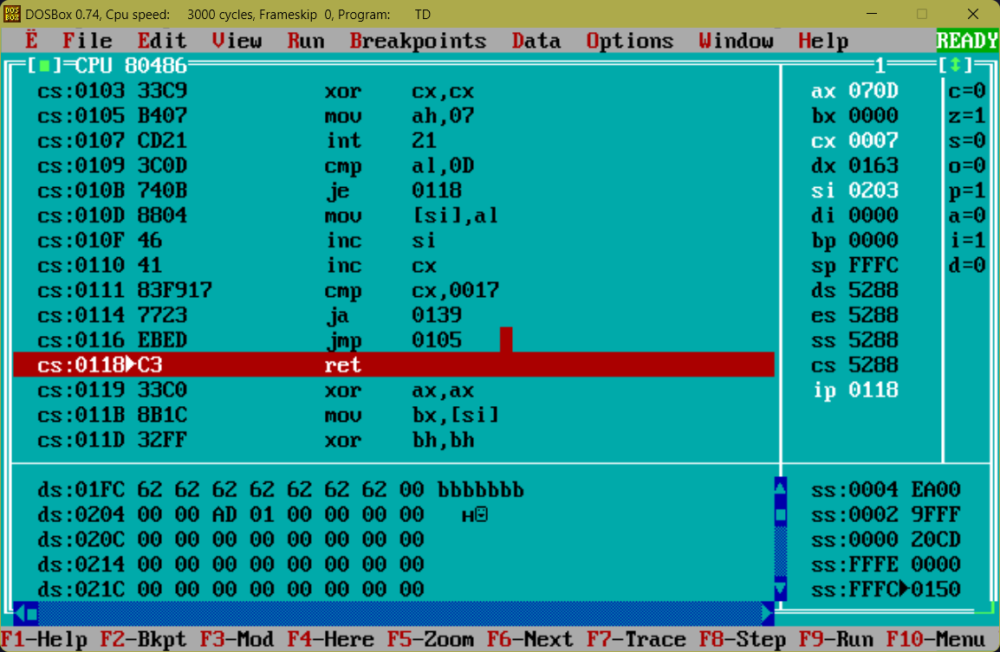
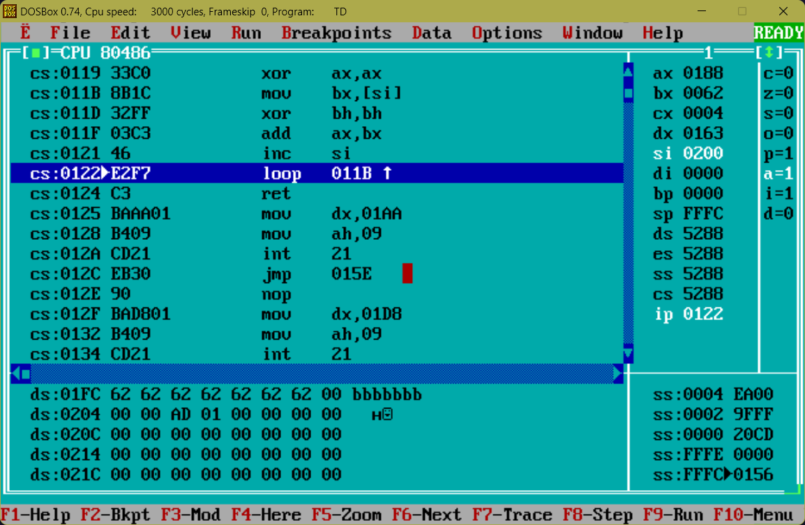
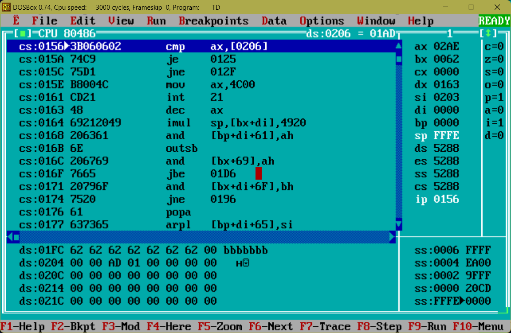

# CrackMeKeyGen

## Buffer overflow hacks

1. I watched the execution of the program step by
step and noticed that password buffer is just before
hash key, so I overflowed it with zeros since
the hash function obviously returns 0 for string of 
0's.Here at address 0x01fc
is the password I typed in. Then the hash function
starts. It's clear that
for string of zeroes it results into 0. Here it compares ax and [0206], which
we can see just after our password in memory!!!
So I just typed in lots of 0.