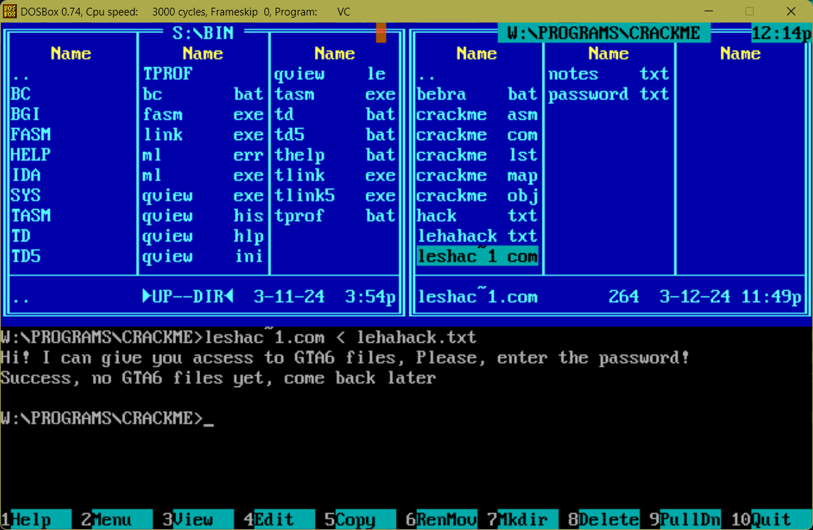
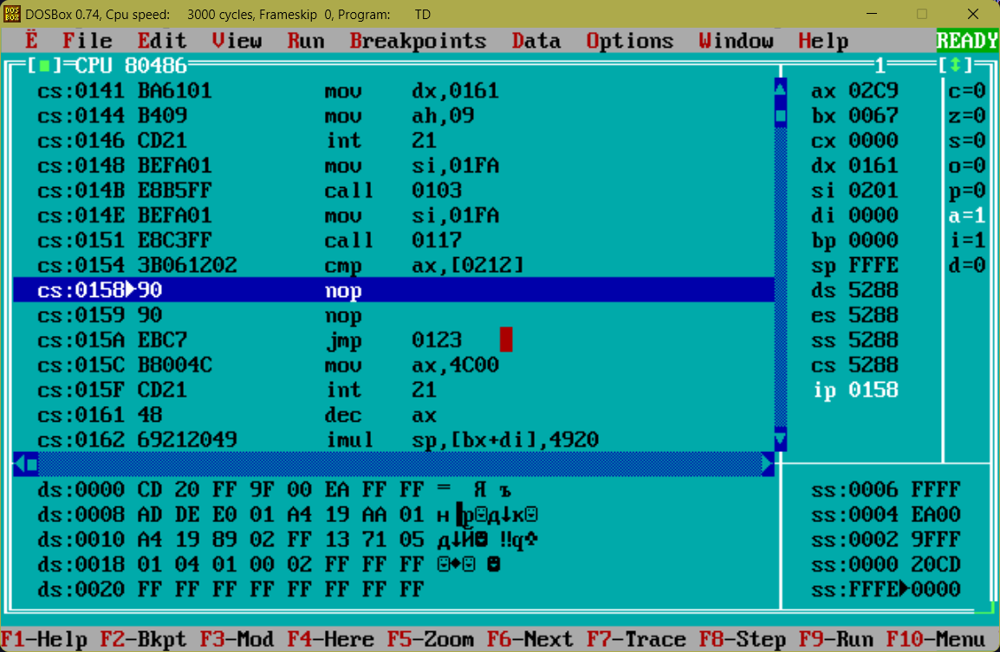
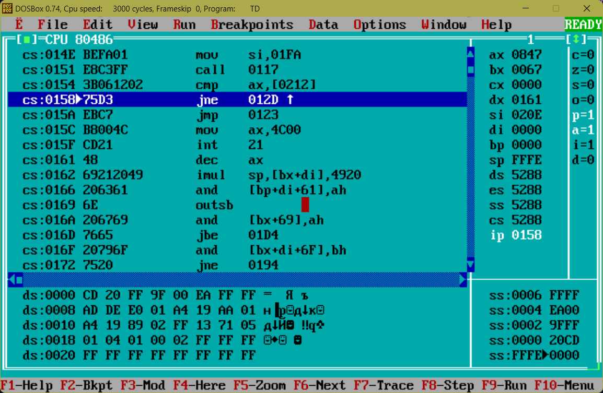

# CrackMeKeyGen

## Buffer overflow hacks

I watched the execution of the program step by
step and noticed that password buffer is just before
hash key, so I overflowed it with zeros since
the hash function obviously returns 0 for string of 
0's.
Here at address 0x01fc is the password I typed in. Then the hash value is placed!

It's clear that for string of zeroes it results into 0.

Here it compares ax and [0206], which
we can see just after our password in memory!!!
So I just typed in lots of 0.

## Keygen hack

Here it calls hash, compares hash and then jumps to
bad place if the hash is wrong. Jo I just nopped
the jne.

